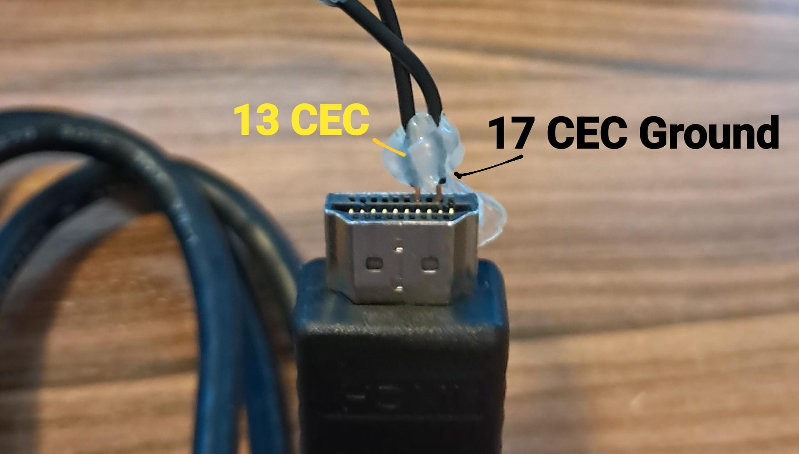
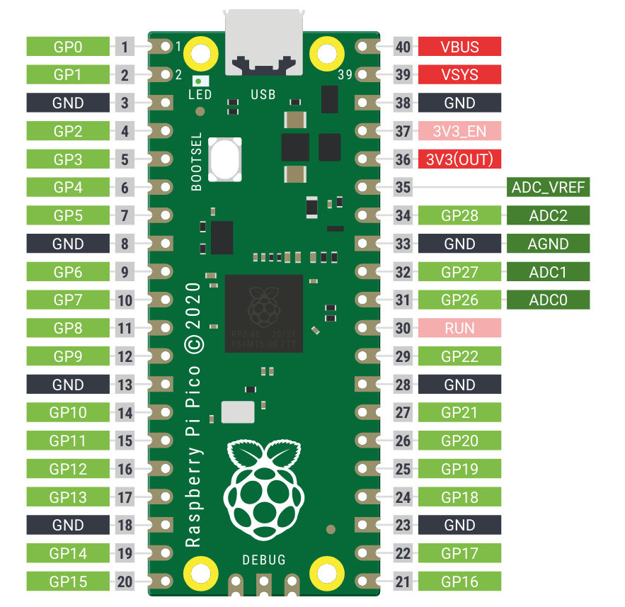

# Wiring

Use a normal HDMI cable for PC video and a second, cut cable for CEC only.

| HDMI pin | Signal | Original Pico |
| --- | --- | --- |
| 13 | CEC | GP11, physical pin 15 |
| 17 | DDC/CEC ground | GND, physical pin 18 |

Insulate every other cut conductor separately. Do not connect the HDMI shield
as a substitute for pin 17.

> [!CAUTION]
> HDMI plug and receptacle diagrams are mirrored. Confirm whether a pinout is
> showing a male or female mating face, and never trust HDMI wire colors.

## Meter checks

Disconnect both the Pico USB and TV before testing:

1. Pin 13 has continuity only to the GP11 wire.
2. Pin 17 has continuity only to the GND wire.
3. Pins 13 and 17 are not shorted together.
4. Neither selected wire is shorted to pin 18, another wire, or the shell.
5. Every unused conductor is insulated and the cable has strain relief.

After connecting the TV, CEC should idle near 3.3 V. The verified TV measured
about 2.95 V; brief drops were normal CEC traffic. Disconnect immediately if
the line stays near 0 V.

## First test

1. Flash and test USB before attaching HDMI to the TV.
2. Enable HDMI-CEC in the TV settings.
3. Connect the CEC-only HDMI plug to a spare TV input.
4. Run `show cec`: the line should be `high` and the Pico should claim a
   playback address such as `0x04`.
5. Run `tv status` before trying `tv standby` or `tv on 3000`.

Replace `3000` with the input carrying PC video. The CEC-only cable may be in a
different TV input because CEC is a shared bus.

## Why only two wires?

DDC pins 15/16 on the spare input would identify the wrong physical port and
belong to a 5 V I2C interface. HDMI pin 18 is also +5 V. None should be wired
directly to RP2040 GPIO. The Linux client reads EDID from the real GPU output
instead.

References: [HDMI 1.3 specification](https://fpga.mit.edu/6205/_static/F24/default_files/CEC_HDMI_Specification.pdf),
[RP2040 datasheet](https://datasheets.raspberrypi.com/rp2040/rp2040-datasheet.pdf),
and [Linux CEC documentation](https://docs.kernel.org/driver-api/media/cec-core.html).
